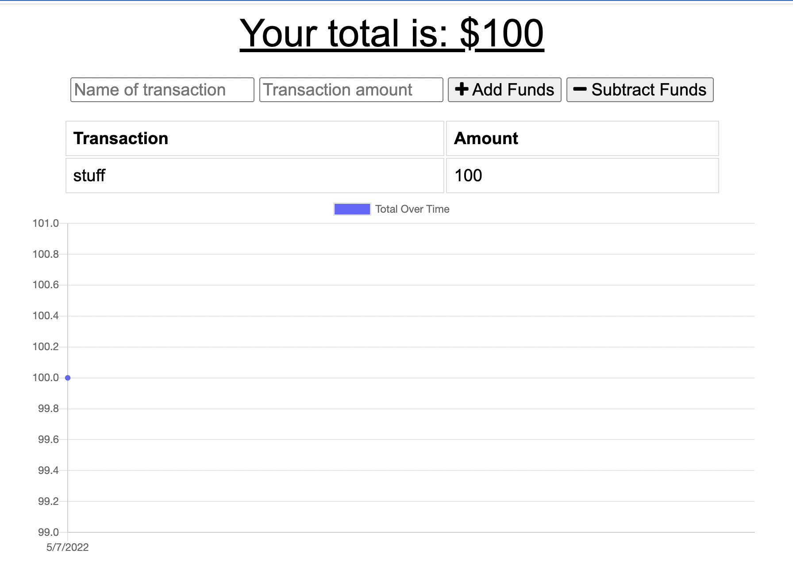

# Budget Tracker PWA

## Description
Hosted via Heroku, this budget tracking application utilizes MongoDB for a database structure. This is a progressive web application, therefore it should allow offline functionality. 

## Built with
Npm, node.js, JS, MongoDB

## Screenshot 

## Deployed link
https://peaceful-depths-47196.herokuapp.com/

## Questions
Email: kbader91@gmail.com